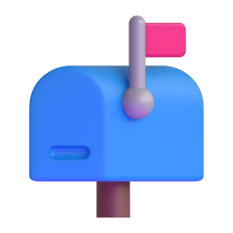

<h3 align="center">Hi , I'm Mayanna Silva Oliveira</h1>
<h5 align="center">A System Analyst graduated in System Analysis and Development with a degree in System Engineering and certified CTFL-ISTQB® that is actually working as IT Freelancer.
</h3>

    
    
    
    
    
    
    
    
    
      

 

    
 

-  I’m currently learning more about , ,  and .
-  I regularly write articles in .

-  My profile in Stackoverflow .

-   I'm a beginning in Codewar .

-  I have been working with `Revenue Management Systems`, `DevOps`,  `APIs`, `Linux`, `Unity Testing`, `Functional Testing` and `Non Functional Testing`.

-  I speak `Portuguese`, `English` and `Spanish`.

-  Keep in touch .
  
-  Please check abour my work experiences in my .

-  Certifications: `CTFL-ISTQB®`, `SFC™`, `SCMS-F™`, `PMEC™`, `LSSWB™` e `SSYB™`.

-  Some of my hobbies is read books, hiking with my friends and travel with my family.

-  I like to play retro video games in my free time.
  
-  My profile views in .

-  If you want to give me tea please, send a Pix to Mayanna Silva Oliveira .

-  Graduated as System Analist (UNOPAR) and degree in System Engineering (UNIMONTES).

  

    <!--  -->
    
     
  

 
<h3 align="left"> Working</h3> 

I'm working as IT Freelancer testing some kind of websites, APIs, ecommerces and apps.

                     
  

  

    
    
  

<h3 align="left"> Articles in DEV </h3>

 <!-- BLOG-POST-LIST:START -->
- [Terminal do Windows com Oh My Posh](https://dev.to/mayannaoliveira/terminal-do-windows-com-oh-my-posh-14jm)
- [Introdução aos Comandos Git](https://dev.to/mayannaoliveira/introducao-aos-comandos-git-3am7)
- [Atualização do Ubuntu via Terminal](https://dev.to/mayannaoliveira/atualizacao-do-ubuntu-via-terminal-2mp9)
- [Instalação do Docker no Ubuntu](https://dev.to/mayannaoliveira/instalacao-do-docker-no-ubuntu-3jej)
<!-- BLOG-POST-LIST:END -->

_Please, read my articles in [Dev](https://dev.to/mayannaoliveira)._

--- 

<h3 align="left"> Recent Activity </h3>

<!--START_SECTION:activity-->
1. ❌ Closed PR [#28](https://github.com/Chhunneng/programming-starters-project/pull/28) in [Chhunneng/programming-starters-project](https://github.com/Chhunneng/programming-starters-project)
2. 🎉 Merged PR [#1](https://github.com/mayannaoliveira/programming-starters-project/pull/1) in [mayannaoliveira/programming-starters-project](https://github.com/mayannaoliveira/programming-starters-project)
<!--END_SECTION:activity-->

---

<!-- status do todoist -->
<h3 align="left"> Todoist Status </h3>

<!-- TODO-IST:START -->
🏆  1,339 Karma Points           
🌸  Completed 1 tasks today           
✅  Completed 67 tasks so far           
⏳  Longest streak is 1 days
<!-- TODO-IST:END -->

---

<h3 align="left"> Courses Badges </h3>

<!--START_SECTION:badges-->

<!--END_SECTION:badges-->

_Please, check on my badges in [Creddly](https://www.credly.com/users/mayannaoliveira)._
 
---

<!-- Holopin Board -->

<!-- Status do repositório

 -->

<!-- Github avatar / Try Hack Me-->
 

  

    
    
  

