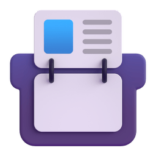
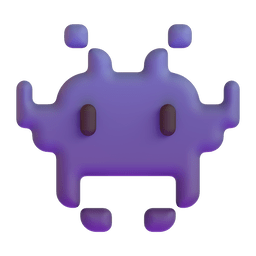

> [!IMPORTANT]
> This is my old profile, the new one is running as mayannaoliveira. I decided to keep the old one just to test new readme things. Thank you!

<h3 align="center">Hi , I'm Mayanna Silva Oliveira</h1>
<h5 align="center">A System Analyst graduated in System Analysis and Development with a degree in System Engineering and certified CTFL-ISTQB® that is actually working as IT Freelancer.
</h3>

    
    
    
    
    
    
      

 

---

-  I’m currently learning more about , ,  and .
-  I regularly write articles in .
-  My profile in Stackoverflow .
-   I'm a beginning in Codewar .
-  I have been working with `Revenue Management Systems`, `DevOps`,  `APIs`, `Linux`, `Unity Testing`, `Functional Testing` and `Non Functional Testing`.
-  I speak `Portuguese`, `English` and `Spanish`.
-  Keep in touch .
-  Please check abour my work experiences in my .
-  Certifications: `CTFL-ISTQB®`, `SFC™`, `SCMS-F™`, `PMEC™`, `LSSWB™` e `SSYB™`.
-  Some of my hobbies is read books, hiking with my friends and travel with my family.
-  I like to play retro video games in my free time.
-  My profile views in .
-  If you want to give me tea please, send a Pix to Mayanna Silva Oliveira .
-  Graduated as System Analyst (UNOPAR) and degree in System Engineering (UNIMONTES).

---

 
                                      
 
  

  

    
    
  

--- 

<h3 align="left"> Recent Activity </h3>

<!--START_SECTION:activity-->
1. 🗣 Commented on [#135](https://github.com/maxam2017/productive-box/issues/135#issuecomment-3102708965) in [maxam2017/productive-box](https://github.com/maxam2017/productive-box)
2. 💪 Opened PR [#1567](https://github.com/abhisheknaiidu/awesome-github-profile-readme/pull/1567) in [abhisheknaiidu/awesome-github-profile-readme](https://github.com/abhisheknaiidu/awesome-github-profile-readme)
<!--END_SECTION:activity-->

---

<!-- status do todoist -->
<h3 align="left"> Todoist Status </h3>

<!-- TODO-IST:START -->
🏆  2,765 Karma Points           
🌸  Completed 6 tasks today           
✅  Completed 118 tasks so far           
⏳  Longest streak is 3 days
<!-- TODO-IST:END -->

---

<h3 align="left"> Credly Badges </h3>

<!--START_SECTION:badges-->
<!--END_SECTION:badges-->

_Please, check on all of my badges in [Credly](https://www.credly.com/users/mayannaoliveira)._
 
---

<!-- Holopin Board -->

    

